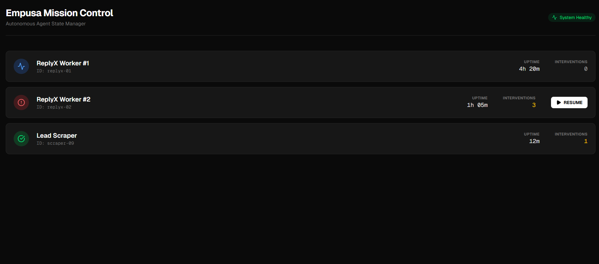
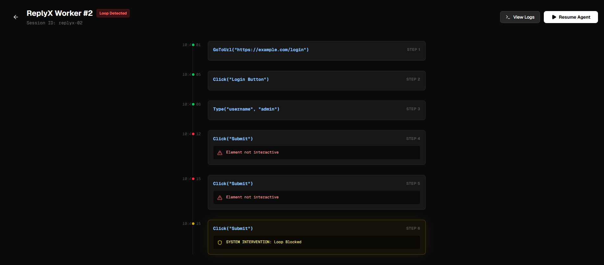

<div align="center">
  
  
  # 🎯 Empusa: Mission Control for Autonomous Agents
  
  **⚡ Real-Time Intervention. Watch Empusa catch loops as they happen.**
  
  [](https://opensource.org/licenses/MIT)
  [](https://nextjs.org/)
  [](https://www.typescriptlang.org/)
  
</div>

---

## 🔥 The Problem

You've built an autonomous agent. It works... until it doesn't.

- **Infinite retry loops** drain your API budget while you sleep
- **Hallucinated steps** cause agents to click the same button 47 times
- **Timeout failures** leave you parsing 5,000 lines of JSON logs at 2 AM
- **No visibility** into what went wrong or where the agent got stuck

**Empusa fixes this.**

---

## 📸 Screenshots

### Mission Control Dashboard


*Real-time overview of all running agents with status indicators and intervention counts*

### Time Travel Debugger


*Step-by-step execution timeline with success/failure states and loop detection*

---

## ✨ Key Features

### 🕵️‍♂️ **Time Travel Debugging**
Visualize execution traces as an interactive timeline. Green = Success, Red = Fail, Yellow = Loop Detected. No more grep-ing through logs.

### 🔄 **Adaptive Loop Detection**
The system automatically identifies when an agent is stuck in a retry loop and shows exactly where intervention occurred. Watch the yellow pulse in action.

### ⏯️ **Human-in-the-Loop Resume** *(Planned)*
Pause bad runs, inspect the state, fix the issue, and resume without restarting from scratch. Save hours of debugging time.

### ⚡ **Universal Compatibility**
Built for OpenClaw logs but designed to work with any Agent Protocol (LangChain, AutoGPT, custom frameworks). Plug in your telemetry and go.

---

## 🏗️ Origin Story

This tool was born from fixing the **critical Infinite Loop bug in OpenClaw** (PR #9759). After watching agents burn through $200 in API credits overnight, we realized the ecosystem needed better observability.

**We built this because we needed it.** Now we're open-sourcing it for the community.

---

## 🚀 Quick Start

```bash
# Clone the repository
git clone https://github.com/justin55afdfdsf5ds45f4ds5f45ds4/EmpusaAI.git
cd EmpusaAI

# Install dependencies
npm install

# Run the development server
npm run dev
```

Open [http://localhost:3000](http://localhost:3000) to see the dashboard.

### Testing with Sample Data

Run the test script to send sample logs to the dashboard:

```bash
node scripts/test-ingest.js
```

This will create a test session with 5 log entries including a loop detection. The script will output a URL to view the session.

---

## 📡 API Reference

### POST `/api/logs`

Ingest agent execution logs in real-time.

**Request Body:**
```json
{
  "sessionId": "session-123",
  "step": 1,
  "action": "Click(Login)",
  "status": "success",
  "error": "Optional error message",
  "timestamp": "2026-02-06T10:42:01.000Z"
}
```

**Status Values:**
- `success` - Step completed successfully
- `failure` - Step failed with error
- `loop_detected` - System detected infinite loop

**Response:**
```json
{
  "success": true,
  "id": 1
}
```

### GET `/api/logs?sessionId={id}`

Retrieve all logs for a specific session.

**Response:**
```json
{
  "logs": [
    {
      "id": 1,
      "session_id": "session-123",
      "step": 1,
      "action": "Click(Login)",
      "status": "success",
      "timestamp": "2026-02-06T10:42:01.000Z"
    }
  ]
}
```

---

## 🛠️ Tech Stack

<div align="center">

| Technology | Purpose |
|------------|---------|
| **Next.js 14** | React framework with App Router |
| **TypeScript** | Type-safe development |
| **Tailwind CSS** | Utility-first styling |
| **Lucide Icons** | Beautiful, consistent iconography |

</div>

---

## 📋 Roadmap

- [x] Real-time agent status dashboard
- [x] Execution timeline visualization
- [x] Loop detection system
- [ ] Live log streaming
- [ ] State inspection & editing
- [ ] Resume from checkpoint
- [ ] Multi-agent orchestration view
- [ ] Cost tracking & alerts

---

## 🤝 Contributing

We welcome contributions! Whether it's:

- 🐛 Bug reports
- 💡 Feature requests
- 📖 Documentation improvements
- 🔧 Code contributions

Check out our [Contributing Guide](CONTRIBUTING.md) to get started.

---

## 📄 License

```
MIT License

Copyright (c) 2026 EmpusaAI

Permission is hereby granted, free of charge, to any person obtaining a copy
of this software and associated documentation files (the "Software"), to deal
in the Software without restriction, including without limitation the rights
to use, copy, modify, merge, publish, distribute, sublicense, and/or sell
copies of the Software, and to permit persons to whom the Software is
furnished to do so, subject to the following conditions:

The above copyright notice and this permission notice shall be included in all
copies or substantial portions of the Software.

THE SOFTWARE IS PROVIDED "AS IS", WITHOUT WARRANTY OF ANY KIND, EXPRESS OR
IMPLIED, INCLUDING BUT NOT LIMITED TO THE WARRANTIES OF MERCHANTABILITY,
FITNESS FOR A PARTICULAR PURPOSE AND NONINFRINGEMENT. IN NO EVENT SHALL THE
AUTHORS OR COPYRIGHT HOLDERS BE LIABLE FOR ANY CLAIM, DAMAGES OR OTHER
LIABILITY, WHETHER IN AN ACTION OF CONTRACT, TORT OR OTHERWISE, ARISING FROM,
OUT OF OR IN CONNECTION WITH THE SOFTWARE OR THE USE OR OTHER DEALINGS IN THE
SOFTWARE.
```

See [LICENSE](LICENSE) file for full details.

---

## 🙏 Acknowledgments

Built by developers who got tired of debugging agents in production. Special thanks to the OpenClaw community for inspiration and feedback.

---

<div align="center">
  
  **⭐ If this saves you from one 2 AM debugging session, give us a star!**
  
  [Report Bug](https://github.com/justin55afdfdsf5ds45f4ds5f45ds4/EmpusaAI/issues) · [Request Feature](https://github.com/justin55afdfdsf5ds45f4ds5f45ds4/EmpusaAI/issues) · [Documentation](https://github.com/justin55afdfdsf5ds45f4ds5f45ds4/EmpusaAI/wiki)
  
</div>
